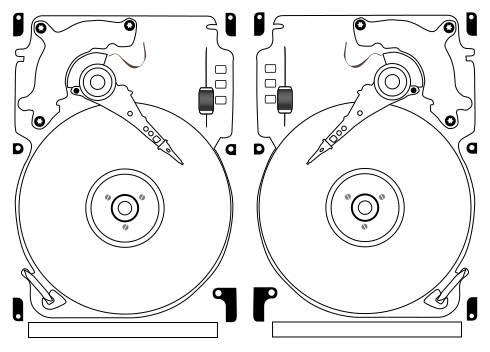

# awesome-linuxaudio

A list of software and resources for professional audio/video/live events production on the Linux platform

**Work in progress** - See current [issues](https://gitlab.com/nodiscc/awesome-linuxaudio/issues) and [CONTRIBUTING](CONTRIBUTING.md).

This list is provided to help you build your own GNU/Linux based A/V production environment. Most of the listed software is packaged for [Debian](http://debian.org/), and should be directly installable using your package manager. Software that can be run on other GNU/Linux distributions may also be added to the list. This list focuses on sound, video, lighting and live applications. Software listed here is [Free Software](https://en.wikipedia.org/wiki/Free_software) unless noted otherwise.

-------------------------

List keys:

- ◼ Debian package: can be installed directly using APT on Debian and derivatives.
- ▒ KXStudio package: can be installed using APT on KXStudio or Debian with KXStudio repositories enabled.
- © Non-Free/closed source software: programs that restrict use/study/modification/distribution.

-------------------------

- [Software](#software)
    - [DAW/Sequencers](#dawsequencers)
    - [Trackers](#trackers)
    - [Audio Editors](#audio-editors)
    - [Samplers](#samplers)
    - [Effects/Processing](#effectsprocessing)
    - [Collections](#collections)
    - [EQ](#eq)
    - [Other FX](#other-fx)
    - [DJing / Vinyl emulation](#djing--vinyl-emulation)
    - [Synthesizers](#synthesizers)
    - [Synthesizers - Additive](#synthesizers---additive)
    - [Synthesizers - Subtractive](#synthesizers---subtractive)
    - [Synthesizers - FM](#synthesizers---fm)
    - [Synthesizers - Wavetable](#synthesizers---wavetable)
    - [Synthesizers - Other](#synthesizers---other)
    - [Synthesizers - Modular](#synthesizers---modular)
    - [Synthesizers - Organ simulators](#synthesizers---organ-simulators)
    - [Audio utilities](#audio-utilities)
    - [Audio utilities - Misc](#audio-utilities---misc)
    - [Audio utilities - Meters & Analysis](#audio-utilities---meters--analysis)
    - [Audio utilities - Tuners & Metronomes](#audio-utilities---tuners--metronomes)
    - [Audio utilities - MIDI Utilities](#audio-utilities---midi-utilities)
    - [Audio utilities - Transcoding](#audio-utilities---transcoding)
    - [Audio utilities - CD/DVD Ripping](#audio-utilities---cddvd-ripping)
    - [System utilities](#system-utilities)
    - [System utilities - JACK](#system-utilities---jack)
    - [System utilities - ALSA](#system-utilities---alsa)
    - [System utilities - Firewire](#system-utilities---firewire)
    - [System utilities - Pipewire](#system-utilities---pipewire)
    - [System utilities - Plugin hosts & adapters](#system-utilities---plugin-hosts--adapters)
    - [System utilities - Pulseaudio](#system-utilities---pulseaudio)
    - [System utilities - Other](#system-utilities---other)
    - [System utilities - Network streaming/broadcasting](#system-utilities---network-streamingbroadcasting)
    - [Lighting](#lighting)
    - [Video](#video)
    - [CGI & 3D Modeling](#cgi--3d-modeling)
    - [Authoring](#authoring)
    - [Signal processing/electronics](#signal-processingelectronics)
    - [Score Editors](#score-editors)
    - [Media players](#media-players)
    - [Metapackages](#metapackages)
    - [Linux Distributions](#linux-distributions)
- [SAMPLES/PRESETS/RESOURCES](#samplespresetsresources)
- [DOCUMENTATION](#documentation)
    - [Other Software Lists](#other-software-lists)
    - [Documentation/Blogs](#documentationblogs)
    - [Communities/Forums](#communitiesforums)
- [CONTRIBUTING](#contributing)
- [MIRRORS](#mirrors)
- [LICENSE](#license)

-----------------------------------

## Software

<!-- BEGIN SOFTWARE LIST -->

### DAW/Sequencers

* **[ardour](http://ardour.org/)** - Digital Audio Workstation (DAW) and Multichannel Hard Disk Recorder (HDR) ([◼](https://packages.debian.org/sid/ardour)) `▒`
* **[lmms](http://lmms.io/)** - Linux Multimedia Studio ([◼](https://packages.debian.org/sid/lmms)) `▒`
* **[vcvrack](https://vcvrack.com/)** - Open-source virtual Eurorack DAW `▒`
* [1BITDRAGON](https://1bitdragon.com/) - easy to use sample based sequencer. Rhythm Generators, arpeggiators, MIDI/WAV export. `©`
* [AudioNodes](https://audionodes.com/) - Free, modular audio production suite with multi-track audio mixing, audio effects, parameter automation, MIDI editing, synthesis, cloud production, custom MIDI i/o, and more. ([Browser version](https://audionodes.com/online/)) `©`
* [BespokeSynth](https://github.com/BespokeSynth/BespokeSynth) - software modular synthesizer. ([◼](https://packages.debian.org/sid/bespokesynth))
* [Bitwig Studio](https://www.bitwig.com/en/bitwig-studio.html) - dynamic software for creation and performance of your musical ideas on stage or in the studio. `©` 
* [dino](http://dino.nongnu.org/) - Integrated MIDI piano roll editor and sequencer engine
* [friniika](http://www.frinika.com/) - A complete music workstation for Windows/Linux/OSX 
* [Harrison Mixbus](http://harrisonconsoles.com/site/mixbus.html) - the first full-featured DAW with true analog style mixing. `©`
* [helio-workstation](https://helio.fm/) - Free linear-based music For macOS, Linux, Windows, iOS and Android, with clean interface, version control, synchronization between devices, undo history, and more. `▒`
* [meterec](http://meterec.sourceforge.net/) - minimalistic multi track recorder ([◼](https://packages.debian.org/sid/meterec))
* [muse](https://muse-sequencer.github.io/) - Qt4-based audio/MIDI sequencer ([◼](https://packages.debian.org/sid/muse))
* [ossia score](https://ossia.io/) - Interactive sequencer with intelligent timelines supporting audio, video, OSC, MIDI, DMX and more.
* [qtractor](http://qtractor.sourceforge.net/) - MIDI/Audio multi-track sequencer application ([◼](https://packages.debian.org/sid/qtractor))
* [Radium Editor](http://users.notam02.no/~kjetism/radium/) -  Radium is a music editor with a new type of interface.
* [REAPER](https://www.reaper.fm/) - A complete digital audio production application for computers, offering a full multitrack audio and MIDI recording, editing, processing, mixing and mastering toolset. `©`
* [rosegarden](http://www.rosegardenmusic.com/) - music editor and MIDI/audio sequencer ([◼](https://packages.debian.org/sid/rosegarden))
* [seq24](http://www.filter24.org/seq24/) - Minimalist Real time MIDI sequencer ([◼](https://packages.debian.org/sid/seq24))
* [sequencer64](https://github.com/ahlstromcj/sequencer64) - Real time MIDI sequencer, a major reboot of seq24 with many new features.
* [Stargate DAW](https://github.com/stargatedaw/stargate) - Cross-platform, all-in-one DAW and plugin suite
* [Tracktion](http://www.tracktion.com/) - The musician's DAW  `©`
* [traverso](http://traverso-daw.org/) - Multitrack audio recorder and editor ([◼](https://packages.debian.org/sid/traverso))
* [Zrythm](https://www.zrythm.org/) - A highly automated and intuitive digital audio workstation

### Trackers

* [bambootracker](https://bambootracker.github.io/BambooTracker/) - Cross-platform music tracker for the Yamaha YM2608 (OPNA) sound chip which was used in NEC PC-8801/9801 series computers. ([◼](https://packages.debian.org/sid/bambootracker))
* [cheesecutter](https://github.com/theyamo/CheeseCutter) - Tracker program for composing music for the SID chip. ([◼](https://packages.debian.org/sid/cheesecutter))
* [ft2-clone](https://github.com/8bitbubsy/ft2-clone) - Fasttracker 2 clone. ([◼](https://packages.debian.org/sid/sound/ft2-clone))
* [furnace](https://github.com/tildearrow/furnace) - Multi-system chiptune tracker.
* [goattracker](https://sourceforge.net/projects/goattracker2/) - C64 music editor. ([◼](https://packages.debian.org/sid/goattracker))
* [hivelytracker](http://www.hivelytracker.co.uk/) - Music tracker program based upon the AHX. ([◼](https://packages.debian.org/sid/hivelytracker))
* [klystrack](https://github.com/kometbomb/klystrack) - Chiptune tracker. ([◼](https://packages.debian.org/sid/klystrack))
* [komposter](http://komposter.haxor.fi/) - lightweight music composing system. ([◼](https://packages.debian.org/sid/komposter))
* [milkytracker](http://www.milkytracker.org/) - Music creation tool inspired by Fast Tracker 2. ([◼](https://packages.debian.org/sid/milkytracker))
* [pt2-clone](https://16-bits.org/pt2.php) - Multi-platform clone of the classic music making software ProTracker 2 from the Commodore Amiga days. ([◼](https://packages.debian.org/sid/pt2-clone))
* [Renoise](http://www.renoise.com/products/renoise) - Digital Audio Workstation (DAW) using a tracker-based approach. `©`
* [schism](http://schismtracker.org/) - ImpulseTracker clone aiming at providing the same look & feel. ([◼](https://packages.debian.org/sid/schism))
* [tiatracker](https://bitbucket.org/kylearan/tiatracker) - music tracker for making Atari VCS 2600. ([◼](https://packages.debian.org/sid/tiatracker))
* [tutka](http://www.nongnu.org/tutka/) - tracker style MIDI sequencer. ([◼](https://packages.debian.org/sid/tutka))
* [vht](https://github.com/rdybka/vht) - live midi sequencer/tracker for JACK/GTK.
* [zytrax](https://github.com/reduz/zytrax) - Easy to use, tracker-inspired music sequencer. ([◼](https://packages.debian.org/sid/zytrax))

### Audio Editors

* **[audacity](https://www.audacityteam.org/)** - fast, cross-platform audio editor ([◼](https://packages.debian.org/sid/audacity))
* [eisenkraut](http://www.sciss.de/eisenkraut/) - A multi-channel and hi-res capable audio file editor
* [kwave](https://www.kde.org/applications/multimedia/kwave/) - sound editor for KDE ([◼](https://packages.debian.org/sid/kwave))
* [LAoE](http://www.oli4.ch/laoe/home.html) - Rich featured graphical audio sample editor featuring multi-layers, floating-point samples, volume-masks, variable selection-intensity, spectrogram editing, and plugins `2011`
* [mhwaveedit](https://github.com/magnush/mhwaveedit/) - Simple and fast GTK2 sound editor ([◼](https://packages.debian.org/sid/mhwaveedit)) `2013`
* [ocenaudio](https://www.ocenaudio.com/) - cross-platform, easy to use, fast and functional audio editor `©`
* [ReZound](http://rezound.sourceforge.net/) - ReZound aims to be a stable, open source, and graphical audio file editor primarily for but not limited to the Linux operating system. `2008`
* [Shuriken beat slicer](https://rock-hopper.github.io/shuriken/) - beat slicer with beat detection and time stretching capabilities. Easy QT4 interface to slice up drum loops, assign hits to MIDI keys, and change the tempo of loops in real-time.
* [smasher](http://sourceforge.net/projects/smasher/) - Cross-platform audio loop slicer designed to create sliced loops from WAV, MP3, FLAC or AIFF files in seconds without a sequencer `2013`
* [Sound Studio](http://sourceforge.net/projects/studio/) - A simple (minimal) light-weight tool for editing smaller soundfiles. Because Sound Studio uses Sox, it can cope with a wide variety of audio file formats. `2013`
* [tenacity](https://tenacityaudio.org/) - an easy-to-use, cross-platform multi-track audio editor/recorder

### Samplers

* **[samplv1](http://samplv1.sourceforge.net/)** - Polyphonic sampler synthesizer. ([◼](https://packages.debian.org/sid/samplv1))
* [Ami-Sampler-VST](https://github.com/astriiddev/Ami-Sampler-VST) - VSTi 8-bit Sampler inspired by the sound of the famous Commodore Amiga for Windows/MacOS/Linux using VST3/AU/LV2
* [avldrums.lv2](https://x42-plugins.com/x42/x42-avldrums) - drum sample player plugin dedicated to Glen MacArthur's AVLdrums. Rapidly sequence and mix midi-drums. `▒`
* [bliss](https://www.discodsp.com/bliss/) - Performance sampler featuring scalable & themeable GUI, VSTi sampling, 8 macro assignments, dual zero delay feedback filters, sample editor, 7 built-in effects, flexible modulation, parameter morphing and highest offline resampling quality using 512 points SINC algorithm. `©`
* [dgedit](http://www.drumgizmo.org/wiki/) - drum kit editor for DrumGizmo ([◼](https://packages.debian.org/sid/dgedit))
* [drumgizmo](http://www.drumgizmo.org/wiki/) - multichannel, multilayered, cross-platform drum plugin and stand-alone application. It enables you to compose drums in midi  and mix them with a multichannel approach ([◼](https://packages.debian.org/sid/drumgizmo)) `▒`
* [drumlabooh](https://github.com/psemiletov/drumlabooh) - LV2/VSTi drum machine that can use Hydrogen, SFZ, and own drumkit formats
* [freewheeling](http://freewheeling.sourceforge.net) - live looping musical instrument ([◼](https://packages.debian.org/sid/freewheeling))
* [giada](https://www.giadamusic.com/) - hardcore loop machine ([◼](https://packages.debian.org/sid/giada)) `▒`
* [hydrogen](http://www.hydrogen-music.org/) - advanced drum machine/step sequencer ([◼](https://packages.debian.org/sid/hydrogen))
* [hydrogen-drumkits](http://www.hydrogen-music.org/?p=drumkits) - drumkits for Hydrogen ([◼](https://packages.debian.org/sid/hydrogen-drumkits)) `▒`
* [hydrogen-drumkits-effects](http://www.hydrogen-music.org/?p=drumkits) - collection of unusual drumkits for Hydrogen ([◼](https://packages.debian.org/sid/hydrogen-drumkits-effects)) `▒`
* [Just-a-Sample](https://github.com/BOBONA/Just-a-Sample) - Just a Sample is a modern, open-source audio sampler
* [kluppe](http://kluppe.klingt.org/) - Loop-player and recorder designed for live use. ([◼](https://packages.debian.org/sid/kluppe))
* [linuxsampler-all](https://linuxsampler.org/) - Realtime audio sampler. (Standalone, DSSI, LV2 and VST) `▒`
* [luppp](https://github.com/openAVproductions/openAV-Luppp) - Music creation tool, intended for live use. `▒`
* [qsampler](http://qsampler.sf.net/) - LinuxSampler GUI frontend based on the Qt toolkit. ([◼](https://packages.debian.org/sid/qsampler))
* [redux](http://www.renoise.com/products/redux) - Sample-based instrument, combined with a powerful phrase sequencer. `©`
* [sfizz](https://sfz.tools/sfizz/) - SFZ sampler and synth (library, AU/LV2/VST3 plugins and JACK standalone).
* [shoopdaloop](https://github.com/SanderVocke/shoopdaloop) - A (live) looping application with DAW elements.
* [sooperlooper](http://www.essej.net/sooperlooper/) - Looping sampler. ([◼](https://packages.debian.org/sid/sooperlooper))
* [sooperlooper-lv2](https://github.com/moddevices/sooperlooper-lv2-plugin) - Looping sampler plugin. `▒`
* [soundux](https://soundux.rocks/) - A cross-platform soundboard
* [superboucle](https://github.com/Vampouille/superboucle) - Loop application synced with jack transport.
* [TAL-Sampler](https://tal-software.com/products/tal-sampler) - full featured analog modeled synthesizer with a sampler engine as sound source, including a powerful modulation matrix and a high quality self-oscillating 24/12/6 dB low pass filter `©`
* [JAMin](https://jamin.sourceforge.net/en/about.html) - Audio mastering from a mixed down multitrack source with JACK. ([◼](https://packages.debian.org/sid/jamin))
* [SpectMorph](https://spectmorph.org/) - analyze samples of musical instruments, and combine them (morphing).

### Effects/Processing

### Collections

* **[calf-plugins](https://calf-studio-gear.org/)** - Calf Studiogear - audio effects and sound generators ([◼](https://packages.debian.org/sid/calf-plugins))
* **[dpf-plugins](https://github.com/DISTRHO/DPF-Plugins)** - audio plugin collection from DISTRHO `▒`
* **[freaked-plugins](https://github.com/pjotrompet/Freaked)** - Granulator, pre-delay, reverb tail and distortion LV2 Plugins `▒`
* **[Linux Studio Plugins (LSP)](https://lsp-plug.in/)** - Collection of Open Source LV2/LADSPA/VST/standalone audio processing applications. ([◼](https://packages.debian.org/sid/lsp-plugins))
* **[tal-plugins](https://tal-software.com/)** - Togu Audio Line Plugins (Dub-3, Filter/-2, Reverb/-2/-3, Vocoder-2) `▒`
* [ACMT Essential VST Plug-Ins Collection for Linux](https://www.acmt.co.uk/products/download-acmt-essential) - A comprehensive range of essential high-end analogue modelled plug-ins for Linux `©`
* [amb-plugins](https://kokkinizita.linuxaudio.org/linuxaudio/ladspa/) - ambisonics LADSPA plugins ([◼](https://packages.debian.org/sid/amb-plugins))
* [artyfx](https://github.com/openAVproductions/openAV-ArtyFX) - Arty FX plugin suite `▒`
* [avw.lv2](https://github.com/mfisher31/avwlv2) - collection of Voltage Controlled LV2 modules ([◼](https://packages.debian.org/sid/avw.lv2)) `2013`
* [BYOD](https://chowdsp.com/products.html) - Build-Your-Own-Distortion is an audio plugin that allows the user to create custom guitar effects, with a focus on guitar distortion
* [caps-lv2](https://github.com/moddevices/caps-lv2) - LV2 port for the CAPS Audio Plugin Suite `▒`
* [caps](http://quitte.de/dsp/caps.html) - C* Audio Plugin Suite (CAPS) comprises a range of classic sound effects and a few more basic audio DSP units, signal and noise generators. ([◼](https://packages.debian.org/sid/caps))
* [cmt](http://www.ladspa.org/cmt/overview.html) - a collection of LADSPA plugins ([◼](https://packages.debian.org/sid/cmt)) `▒`
* [drowaudio-plugins](http://www.drowaudio.co.uk/products.php) - dRowAudio Plugins (LV2 & VST) `▒`
* [fomp](https://drobilla.net/software/fomp.html) - 1 auto-wah, 1 EQ, 3 chorus, 5 filters, and 3 oscillators LV2 plugins. ([◼](https://packages.debian.org/sid/fomp)) `▒`
* [ardour-lv2-plugins](https://ardour.org/) - Set of LV2 plugins provided by Ardour. ([◼](https://packages.debian.org/sid/ardour-lv2-plugins))
* [Chow Tape Model](https://chowdsp.com/products.html) - digital emulation of a reel-to-reel analog tape machine. The original algorithm was developed to emulate the Sony TC-260
* [Chow Matrix](https://chowdsp.com/products.html) - infinitely growable delay effect, with complex internal modulation and feedback. With extra features including pitch-shifting, diffusion, and distortion
* [Chow Centaur](https://chowdsp.com/products.html) - digital emulation of the Klon Centaur guitar pedal
* [Chow Phaser](https://chowdsp.com/products.html) - digital phaser effect originally inspired by the Schulte Compact Phasing 'A'
* [ChowDSP VCV](https://chowdsp.com/products.html) - several modules for VCV Rack, including ports of ChowTape and ChowPhaser. Other modules include distortion effects, modal filters, and more
* [infamous-plugins](https://ssj71.github.io/infamousPlugins/) - creative LV2 plugins ([◼](https://packages.debian.org/sid/infamous-plugins)) `▒`
* [invada-studio-plugins-ladspa](https://launchpad.net/invada-studio/+download) - Invada Studio Plugins - a set of LADSPA audio plugins ([◼](https://packages.debian.org/sid/invada-studio-plugins-ladspa)) `▒`
* [invada-studio-plugins-lv2](https://launchpad.net/invada-studio/+download) - Invada Studio Plugins - a set of LV2 audio plugins ([◼](https://packages.debian.org/sid/invada-studio-plugins-lv2)) `▒`
* [juced-plugins](https://distrho.sourceforge.io/ports.php) - Juced Plugins `▒`
* [mda-lv2](https://drobilla.net/software/mda-lv2.html) - Paul Kellett's MDA 36 high-quality plugins ported to LV2 ([◼](https://packages.debian.org/sid/mda-lv2))
* [mda-vst](https://sourceforge.net/projects/mda-vst/) - Paul Kellett's MDA plugins ported to VST `▒`
* [mod-mda-lv2](https://github.com/moddevices/mda-lv2) - Paul Kellett's MDA plugins ported to LV2 (MOD version) `▒`
* [mod-utilities](https://github.com/moddevices/mod-utilities) - LV2 plugin utilities (filters/gain/switches/meter) `▒`
* [psi-plugins](https://github.com/ycollet/psi-plugins) - small collection of LV2 plugins ideal for (but not limited to) electronic music.
* [ste-plugins](http://kokkinizita.linuxaudio.org/linuxaudio/index.html) - stereo LADPSA plugins ([◼](https://packages.debian.org/sid/ste-plugins))
* [swh-lv2](https://github.com/swh/lv2) - Steve Harris's SWH plugins ported to LV2 ([◼](https://packages.debian.org/sid/swh-lv2)) `▒`
* [swh-plugins](https://github.com/swh/ladspa) - Steve Harris's LADSPA plugins ([◼](https://packages.debian.org/sid/swh-plugins)) `▒`
* [tap-plugins](http://tap-plugins.sourceforge.net/) - Tom's Audio Processing LADSPA plugins ([◼](https://packages.debian.org/sid/tap-plugins)) `▒`
* [vco-plugins](http://kokkinizita.linuxaudio.org/linuxaudio/index.html) - LADSPA plugin sporting anti-aliased oscillators ([◼](https://packages.debian.org/sid/vco-plugins)) `▒`
* [x42-plugins](https://github.com/x42/x42-plugins) - Collection of LV2 plugins ([◼](https://packages.debian.org/sid/x42-plugins)) `▒`
* [zam-plugins](http://www.zamaudio.com/) - Plugins for high quality audio processing ([◼](https://packages.debian.org/sid/zam-plugins)) `▒`
* [ZL Audio Plugins](https://github.com/ZL-Audio) - ZL Audio makes audio plugins and audio processing tools

### EQ

* **[eq10q](http://eq10q.sourceforge.net/)** - LV2 equalizer ([◼](https://packages.debian.org/sid/eq10q)) `▒`
* [fil-plugins](http://kokkinizita.linuxaudio.org/linuxaudio/index.html) - parametric equalizer LADSPA plugin ([◼](https://packages.debian.org/sid/fil-plugins)) `▒`
* [luftikus-lv2](https://github.com/DISTRHO/DISTRHO-Ports) - analog modeled equalizer (LV2) `▒`
* [luftikus-vst](https://github.com/DISTRHO/DISTRHO-Ports) - analog modeled equalizer (VST) `▒`

### Other FX

* [abgate](http://abgate.sourceforge.net) - LV2 noise gate plugin ([◼](https://packages.debian.org/sid/abgate))
* [airwin2rack](https://github.com/baconpaul/airwin2rack) - Airwindows plugins, Consolidated into a single Library, Rack Plugin and DAW Plugin
* [autotalent](http://tombaran.info/autotalent.html) - pitch correction LADSPA plugin ([◼](https://packages.debian.org/sid/autotalent)) `▒`
* [beatslash-lv2](https://github.com/blablack/beatslash-lv2) - A set of LV2 plugins to slash, repeat beats. `▒`
* [blop](https://sourceforge.net/projects/blop/) - Bandlimited wavetable-based oscillator plugins for LADSPA hosts. ([◼](https://packages.debian.org/sid/blop)) `▒`
* [blop-lv2](https://drobilla.net/software/blop-lv2.html) - Bandlimited LADSPA oscillator plugins ported to LV2. ([◼](https://packages.debian.org/sid/blop-lv2)) `▒`
* [centered](https://cozy-dsp.itch.io/centered) - this plugin automatically pans the input signal such that it's centered in the stereo field
* [creox](http://zyzstar.kosoru.com/?creox) - a real-time sound/effects processor. 
* [dragonfly-reverb](https://michaelwillis.github.io/dragonfly-reverb/) - bundle of free audio reverb effects. ([◼](https://packages.debian.org/sid/dragonfly-reverb))
* [drc](http://drc-fir.sourceforge.net/) - digital room correction ([◼](https://packages.debian.org/sid/drc))
* [Fire](https://jerryuhoo.github.io/Fire/) - mutiband distortion plugin
* [freqtweak](http://freqtweak.sourceforge.net/) - Realtime audio frequency spectral manipulation
* [g2reverb](https://kokkinizita.linuxaudio.org/linuxaudio/ladspa/) -reverb LADSPA plugin `▒`
* [glitch](http://illformed.com/) - Multi-effects audio plugin with sequencer `©`
* [go-dsp-guitar](https://github.com/andrepxx/go-dsp-guitar) - A cross-platform effects processor / amp simulator for electric guitars and other instruments.  Supports JACK and remote control through web interface.
* [guitarix](https://guitarix.org/) - Rock guitar amplifier for Jack (Standalone/LADSPA/LV2) ([◼](https://packages.debian.org/sid/guitarix)) `▒`
  * [gxplugins](https://github.com/brummer10/GxPlugins.lv2) - extra lv2 plugins from the guitarix project `▒`
* [gxvoxtonebender](https://guitarix.org/) - Fuzz Tonebender LV2 plugin `▒`
* [ir.lv2](https://tomscii.sig7.se/plugins/ir.lv2/) - LV2 IR reverb ([◼](https://packages.debian.org/sid/ir.lv2)) `▒`
* [klangfalter](https://github.com/HiFi-LoFi/KlangFalter) - convolution reverb audio plugin (LV2/VST) `▒`
* [lamb-rs](https://github.com/magnetophon/lamb-rs) - A lookahead compressor/limiter that's soft as a lamb.
* [LoudMax](https://loudmax.blogspot.com/) - Look-Ahead Brickwall Loudness Maximizer LADSPA Plugin with a clean transparent sound. It is designed to retain the original character of the music as much as possible `©`
* [lv2vocoder](https://packages.debian.org/sid/lv2vocoder) - LV2 vocoder plugin ([◼](https://packages.debian.org/sid/lv2vocoder))
* [mod-distortion](https://github.com/mod-audio/mod-distortion) - analog distortion emulation plugin `▒`
* [mod-pitchshifter](https://github.com/mod-audio/mod-pitchshifter) - Pitch Shifter LV2 effects `▒`
* [paulstretch](http://hypermammut.sourceforge.net/paulstretch/) - Extreme sound time-stretch ([◼](https://packages.debian.org/sid/paulstretch))
* [PeakEater](https://github.com/vvvar/PeakEater) - cross-platform wave shaper plugin
* [phasex](http://github.com/williamweston/phasex) - Phase Harmonic Advanced Synthesis EXperiment ([◼](https://packages.debian.org/sid/phasex))
* [pitcheddelay-lv2](https://github.com/DISTRHO/DISTRHO-Ports) - pitch-shifting delay (LV2) `▒`
* [pitcheddelay-vst](https://github.com/DISTRHO/DISTRHO-Ports) - pitch-shifting delay (VST) `▒`
* [radium-compressor](https://github.com/kmatheussen/radium_compressor) - audio compressor for JACK ([◼](https://packages.debian.org/sid/radium-compressor))
* [rakarrack](http://rakarrack.sourceforge.net) - Simple and easy guitar effects processor for GNU/Linux ([◼](https://packages.debian.org/sid/rakarrack))
* [rev-plugins](http://kokkinizita.linuxaudio.org/linuxaudio/index.html) - reverb LADSPA plugin ([◼](https://packages.debian.org/sid/rev-plugins))
* [rkrlv2](https://github.com/ssj71/rkrlv2) - Rakarrack LV2 Plugin Ports
* [RoomReverb](https://www.elephantdsp.com/products/room-reverb/) - mono/stereo to stereo algorithmic reverb
* [rubberband-ladspa](http://www.breakfastquay.com/rubberband/) - LADSPA plugin for audio pitch-shifting ([◼](https://packages.debian.org/sid/rubberband-ladspa))
* [rubberband-lv2](http://www.breakfastquay.com/rubberband/) - LV2 plugin for audio pitch-shifting ([◼](https://packages.debian.org/sid/rubberband-lv2))
* [sonic](https://github.com/waywardgeek/sonic) - Simple utility to speed up or slow down speech ([◼](https://packages.debian.org/sid/sonic))
* [soundstretch](http://www.surina.net/soundtouch/) - Stretches and pitch-shifts sound independently ([◼](https://packages.debian.org/sid/soundstretch))
* [Schroeder](https://www.discodsp.com/schroeder/) - Modeled reverb based on Schroeder reverberator.  `©`
* [stretchplayer](http://www.teuton.org/~gabriel/stretchplayer/) - Audio file player with time stretch and pitch shifting ([◼](https://packages.debian.org/sid/stretchplayer))
* [terminatorx](http://www.terminatorx.org/) - realtime audio synthesizer ([◼](https://packages.debian.org/sid/terminatorx))
* [valentine](https://github.com/tote-bag-labs/valentine) - open source compressor meant to pump and breathe
* [vm.lv2](https://open-music-kontrollers.ch/lv2/vm/) - virtual machine plugin bundle (Control, CV, Audio, Atom) `▒`
* [vocproc](http://hyperglitch.com/dev/VocProc) - LV2 plugin for pitch shifting and vocoding ([◼](https://packages.debian.org/sid/vocproc))
* [wah-plugins](http://kokkinizita.linuxaudio.org/linuxaudio/index.html) - auto-wah LADSPA plugin ([◼](https://packages.debian.org/sid/wah-plugins))
* [wolf-shaper](https://wolf-plugins.github.io/wolf-shaper/) - Waveshaper plugin with a spline-based graph editor
* [zita-at1](http://kokkinizita.linuxaudio.org/linuxaudio/) - JACK autotuner ([◼](https://packages.debian.org/sid/zita-at1))
* [zita-rev1](http://kokkinizita.linuxaudio.org/linuxaudio/zita-rev1-doc/quickguide.html) - pro-audio reverb effect  ([◼](https://packages.debian.org/sid/zita-rev1))

### DJing / Vinyl emulation

* **[mixxx](http://www.mixxx.org/)** - Digital Disc Jockey Interface ([◼](https://packages.debian.org/sid/mixxx))
* [xwax](http://www.xwax.co.uk/) - open-source vinyl emulation software for Linux with timecoded vinyl support ([◼](https://packages.debian.org/sid/xwax))
* [DiscoDOS](http://github.com/JOJ0/discodos) - the geekiest DJ tool on the planet - remember and analyze your DJ sets based on Discogs and AcousticBrainz data ([◼](https://packages.debian.org/sid/discodos))

### Synthesizers

### Synthesizers - Additive

* [add64](https://sourceforge.net/projects/add64/) - additive synthesizer for JACK `▒`
* [andes](https://artfwo.github.io/andes/) - Sound synthesiser based on Perlin noise
* [triceratops-lv2](http://sourceforge.net/projects/triceratops/) - polyphonic additive software synthesizer plugin `▒`
* [vertigo](https://www.discodsp.com/vertigo/) - 256 oscillators additive synth with resynthesis and sound morphing. Imports WAV and BMP. Very accurate recreation of complex musical phrases, drumloops, speech and simple tones. `©`
* [yoshimi](http://yoshimi.sourceforge.net) - software synthesizer based on ZynAddSubFX ([◼](https://packages.debian.org/sid/yoshimi))
* [zynaddsubfx](http://zynaddsubfx.sourceforge.net) - Realtime software synthesizer for Linux ([◼](https://packages.debian.org/sid/zynaddsubfx)) `▒`

### Synthesizers - Subtractive

* [amsynth](https://github.com/amsynth/amsynth) - Two oscillator software synthesizer. ([◼](https://packages.debian.org/sid/amsynth))
* [blepvco](http://www.smbolton.com/linux.html) - LADSPA, minBLEP-based, hard-sync-capable oscillator plugins. ([◼](https://packages.debian.org/sid/blepvco)) `▒`
* [bristol](http://bristol.sourceforge.net/) - Vintage synthesizer emulator. ([◼](https://packages.debian.org/sid/bristol))
  * [monobristol](https://packages.debian.org/sid/monobristol) - Simple GUI for Bristol. ([◼](https://packages.debian.org/sid/monobristol))
* [cursynth](https://www.gnu.org/software/cursynth/) - Cursynth is a polyphonic music synthesizer that runs graphically inside your terminal. `▒`
* [discovery](https://www.discodsp.com/discovery/) - Virtual Analog synthesizer. `©`
* [discovery pro](https://www.discodsp.com/discoverypro/) - Virtual Analog synthesizer + sampler. `©`
* [helm](https://tytel.org/helm/) - Polyphonic synthesizer. `▒`
* [ob-xd](https://www.discodsp.com/obxd/) - OB-Xd is based on the Oberheim OB-X. `▒`
  * [ob-xd](https://github.com/reales/OB-Xd) - Open source version of OB-Xd 
* [sineshaper](http://ll-plugins.nongnu.org/lv2/sineshaper.html) - Monophonic synth plugin with two oscillators and waveshapers.
* [synthv1](http://synthv1.sourceforge.net/) - Old-school polyphonic synthesizer. ([◼](https://packages.debian.org/sid/synthv1)) `▒`
* [whysynth](http://www.smbolton.com/whysynth.html) - DSSI Soft Synth Interface. ([◼](https://packages.debian.org/sid/whysynth))
* [wolpertinger](https://github.com/DISTRHO/DISTRHO-Ports) - Subtractive synth with a sharp bandpass filter. `▒`

### Synthesizers - FM

* [adlplug](https://github.com/jpcima/ADLplug) - FM synthesizer plugins, based on OPL3 and OPN2 sound chip emulations `▒`
* [dexed](https://asb2m10.github.io/dexed/) - FM Plugin Synth closely modeled on the Yamaha DX7, including midi cartridge librarian/manager for the DX7. `▒`
* [hexter](http://dssi.sourceforge.net/) - Yamaha DX7 modeling DSSI plugin ([◼](https://packages.debian.org/sid/hexter)) `▒`
* [OPL](https://www.discodsp.com/opl/) - The OPL is a digital sound synthesis chip developed by Yamaha in the mid 1980s `▒` 
* [juce-opl](https://distrho.sourceforge.io/ports.php) - Emulation of the Yamaha OPL sound chip used in PC sound cards from the 90s. `▒`
* [oxefmsynth](http://www.oxesoft.com/) - 8 operators FM synth

### Synthesizers - Wavetable

* [sorcer](https://github.com/openAVproductions/openAV-Sorcer) - Sorcer polyphonic wavetable synth LV2 plugin `▒`
* [wsynth-dssi](http://www.nekosynth.co.uk/wiki/wsynth) - hack on Xsynth-DSSI to allow wavetable synthesis ([◼](https://packages.debian.org/sid/wsynth-dssi)) `▒`

### Synthesizers - Other

* [Chow Kick](https://chowdsp.com/products.html) - kick drum synthesizer based on creative physical modelling of old drum machine circuits
* **[drumkv1](http://drumkv1.sourceforge.net/)** - old-school drum-kit sampler ([◼](https://packages.debian.org/sid/drumkv1)) `▒`
* **[fabla](https://github.com/openAVproductions/openAV-Fabla2)** - Fabla drum sampler plugin instrument `▒`
* **[foo-yc20-vst](https://github.com/sampov2/foo-yc20)** - VST implementation of a 1969 designed Yamaha combo organ, the YC-20. `▒`
* **[qsynth](http://qsynth.sourceforge.net)** - fluidsynth MIDI sound synthesiser front-end ([◼](https://packages.debian.org/sid/qsynth))
* **[Tracktion BioTek](https://www.tracktion.com/products/biotek)** - new generation of software synth that combines the sounds of nature with a complex synthesis engine to create weird and wonderful organic soundscapes. `©`
* [argotlunar](https://mourednik.github.io/argotlunar/) - Realtime granulator LV2/VST plugin
* [din](http://dinisnoise.org/) - digital audio synthesizer ([◼](https://packages.debian.org/sid/din))
* [drmr](https://github.com/nicklan/drmr) -  An LV2 sampler plugin that (currently) plays hydrogen drum kits `▒`
* [fluid-soundfont-gm](https://packages.debian.org/sid/fluid-soundfont-gm) - Fluid (R3) General MIDI SoundFont (GM)
* [fluid-soundfont-gs](https://packages.debian.org/sid/fluid-soundfont-gs) - Fluid (R3) General MIDI SoundFont (GS)
* [fluidr3-gm-soundfont](https://packages.debian.org/sid/fluidr3-gm-soundfont) - Fluid (R3) Mono GM SoundFont from MuseScore 2
* [fluidsynth/-static](http://www.fluidsynth.org/) - Real-time MIDI software synthesizer with plugins for media players ([◼](https://packages.debian.org/sid/fluidsynth)) `▒`
* [geonkick](https://geonkick.org/) - synthesizer capable of generating a wide range of percussive sounds
* [gmorgan](http://gmorgan.sourceforge.net/) - MIDI rhythm station emulator software
* [Odin 2](https://thewavewarden.com/odin2) - powerful 24-voice polyphonic virtual analog synthesizer with multiple oscillator types LV2/VST3/CLAP
* [paraphrasis](https://github.com/VirtualAnalogy/Paraphrasis) - spectral modeling synthesizer 
* [Surge XT](https://surge-synthesizer.github.io/) - hybrid synthesizer featuring many synthesis techniques, a great selection of filters, a flexible modulation engine, a smorgasbord of effects, and modern features like MPE and microtuning
* [TAL-BassLine-101](https://tal-software.com/products/tal-bassline-101) - monophonic bass synthesizer and a very accurate emulation of the popular SH 101 `©`
* [TAL-J-8](https://tal-software.com/products/tal-j-8) - very accurate emulation of the popular 80’s hardware synthesiser and calibrated after our own Jupiter 8 device `©`
* [TAL-NoiseMaker](https://tal-software.com/products/tal-noisemaker) - free virtual analog synthesizer with a great sound and low CPU usage `©`
* [TAL-U-No-LX](https://tal-software.com/products/tal-u-no-lx) - complete emulation of the popular Juno 60, zero feedback delay filters and carefully calibrated controls make this synth a good replacement for the analog device `©`
* [u-he Diva](https://u-he.com/products/diva/) - Virtual Analogue synthesizer `©`
* [u-he Hive](https://u-he.com/products/hive/) - Uncomplicated, flexible, CPU-friendly hybrid synthesizer `©`
* [u-he Podolski](https://u-he.com/products/podolski/) - free, straightforward, CPU-efficient virtual analogue synthesizer. One oscillator, one filter, one envelope and an arpeggiator / sequencer. `©`
* [u-he Repro](https://u-he.com/products/repro/) - Meticulously modelled reproductions of two famous analogue synthesizers `©`
* [u-he Triple Cheese](https://u-he.com/products/triplecheese/) - Unusual freeware synthesizer without traditional oscillators/wavetables/FM/phase distortion/analogue modelled filters, capable of some surprising sounds. `©`
* [u-he Zebra 2](https://u-he.com/products/zebra2/) - sound-design playground with numerous sound sculpting tools `©`
* [u-he Zebralette](https://u-he.com/products/zebralette/) - A free synthesizer and an introduction to Zebra2’s fantastic oscillators. `©`
* [xsynth-dssi](http://dssi.sourceforge.net) - classic-analog (VCOs/VCF/VCA) style software synthesizer ([◼](https://packages.debian.org/sid/xsynth-dssi))
* [pianoteq](https://www.modartt.com/pianoteq) - Virtual piano based on physical modeling of real instruments. `©`
* [organteq](https://www.modartt.com/organteq) - Physically modelled pipe organ. `©`
* [sointu](https://github.com/vsariola/sointu) - modular software synthesizer for small intros.

### Synthesizers - Modular

* [ams](http://alsamodular.sourceforge.net/) - Realtime modular synthesizer for ALSA ([◼](https://packages.debian.org/sid/ams))
* [BEAST/BSE](https://github.com/tim-janik/beast/) - music composition and modular synthesis application
* [Cardinal](https://cardinal.kx.studio/) - Virtual modular synthesizer plugin
* [ingen](http://drobilla.net/software/ingen) - modular audio processing system for Jack and LV2 based systems. `▒`
* [ams-lv2](https://github.com/blablack/ams-lv2/) - set of Voltage Controlled LV2 modules for Ingen `▒`
* [mcp-plugins](http://kokkinizita.linuxaudio.org/linuxaudio/index.html) - LADSPA plugins designed for Alsa Modular Synth ([◼](https://packages.debian.org/sid/mcp-plugins)) `▒`
* [omins](http://www.nongnu.org/om-synth/omins.html) - collection of LADSPA plugins aimed at modular synthesizers ([◼](https://packages.debian.org/sid/omins))
* [Sunvox](http://www.warmplace.ru/soft/sunvox/) - a small, fast and powerful modular synthesizer with pattern-based sequencer (tracker) `©`
* [TAL-MOD](https://tal-software.com/products/tal-mod) - virtual analog synthesizer with an exceptional sound and almost unlimited modulation possiblities `©`
* [u-he ACE](https://u-he.com/products/ace/) - compact, clear synthesizer, with a careful selection of modules and semi-modular architecture `©`
* [u-he Bazille](https://u-he.com/products/bazille/) - large polyphonic modular system with digital (PD, FM based) oscillators, multimode filters, modulation options, and more `©`

### Synthesizers - Organ simulators

* [aeolus](http://kokkinizita.linuxaudio.org/linuxaudio/aeolus/) - Synthesised pipe organ emulator ([◼](https://packages.debian.org/sid/aeolus))
* [azr3-jack](http://ll-plugins.nongnu.org/azr3/) - drawbar organ simulator
* [horgand](https://github.com/ycollet/horgand) - JACK capable organ softsynth ([◼](https://packages.debian.org/sid/horgand))
* [setbfree](http://setbfree.org) - DSP tonewheel organ ([◼](https://packages.debian.org/sid/setbfree))

### Audio utilities

### Audio utilities - Misc

* **[sox](http://sox.sourceforge.net)** - Swiss army knife of sound processing ([◼](https://packages.debian.org/sid/sox))
* [declick](http://home.snafu.de/wahlm/dl8hbs/declick.html) - a dynamic digital declicker for audio sample files. 
* [ecasound](http://www.eca.cx/ecasound/) - command-line multitrack-capable audio recorder and effect processor ([◼](https://packages.debian.org/sid/ecasound))
* [fadecut](http://github.com/micressor/fadecut) - toolset to rip audiostreams, cut, fade in/out and tag the resulting audiofiles ([◼](https://packages.debian.org/sid/fadecut))
* [gwc](http://gwc.sf.net) - Audio file denoiser ([◼](https://packages.debian.org/sid/gwc))
* [libsox-fmt-all](http://sox.sourceforge.net) - All SoX format libraries ([◼](https://packages.debian.org/sid/libsox-fmt-all))
* [Linux Show Player](http://linux-show-player.sourceforge.net/) a free cue player designed for sound-playback in stage production. The goal of the project is to provide a complete playback software for musical plays, theater shows and similar. ([◼](https://packages.debian.org/sid/linux-show-player))
* [nama](https://packages.debian.org/sid/nama) - Multitrack recording with Ecasound ([◼](https://packages.debian.org/sid/nama))
* [pianobooster](http://pianobooster.sourceforge.net/) - Learn the piano just by playing a game, inspired by Guitar Hero  ([◼](https://packages.debian.org/sid/pianobooster))
* [Samplecat](https://ayyi.github.io/samplecat/) - a program for cataloguing and auditioning audio samples.
* [showq](https://github.com/evandelisle/showq) - MIDI controllable audio player ([◼](https://packages.debian.org/sid/showq))
* [silan](https://packages.debian.org/sid/silan) - commandline tool to detect silence in audio-files
* [silentjack](http://www.aelius.com/njh/silentjack/) - silence detector for the JACK audio system ([◼](https://packages.debian.org/sid/silentjack))
* [sync-audio-tracks](https://github.com/alopatindev/sync-audio-tracks/) - Audio tracks synchronization command-line tool for video editors that don't support it
* [taptempo](https://taptempo.tuxfamily.org/) - A command line tap tempo. Hit enter key with style and you'll get the corresponding number of beats per minute (BPM). ([◼](https://packages.debian.org/sid/taptempo))

### Audio utilities - Meters & Analysis

* [baudline](http://www.baudline.com/index.html) - Time-frequency browser designed for scientific visualization of the spectral domain - Fourier, correlation, transfer function, impulse response, and raster transforms 
* [bitmeter](http://devel.tlrmx.org/audio/) - diagnosis tool for JACK audio software ([◼](https://packages.debian.org/sid/bitmeter))
* [brp-pacu](http://sourceforge.net/projects/brp-pacu/) - audio analysis tool ([◼](https://packages.debian.org/sid/brp-pacu))
* [easyssp-lv2](https://github.com/DISTRHO/DISTRHO-Ports) - audio visualization plugin (spectrometer/goniometer) (LV2) `▒`
* [easyssp-lv2](https://github.com/DISTRHO/DISTRHO-Ports) - audio visualization plugin (spectrometer/goniometer) (VST) `▒`
* [ebumeter](http://kokkinizita.linuxaudio.org/linuxaudio/downloads/) - Loudness measurement according to EBU-R128 ([◼](https://packages.debian.org/sid/ebumeter))
* [jaaa](http://kokkinizita.linuxaudio.org/linuxaudio/index.html#jaaa) - audio signal generator and spectrum analyser ([◼](https://packages.debian.org/sid/jaaa))
* [jackmeter](http://www.aelius.com/njh/jackmeter/) - a basic command line meter for the JACK audio system ([◼](https://packages.debian.org/sid/jackmeter))
* [japa](http://kokkinizita.linuxaudio.org/linuxaudio/) - JACK and ALSA Perceptual Analyser ([◼](https://packages.debian.org/sid/japa))
* [jkmeter](http://kokkinizita.linuxaudio.org/linuxaudio/downloads/index.html) - horizontal or vertical bargraph audio level meter for Jack Audio Connection Kit ([◼](https://packages.debian.org/sid/jkmeter))
* [lufsmeter](https://www.klangfreund.com/lufsmeter/) - measures loudness similar to the human perception of loudness. (LV2/VST) `▒`
* [meterbridge](https://packages.debian.org/sid/meterbridge) - Collection of Audio meters for the JACK audio server ([◼](https://packages.debian.org/sid/meterbridge))
* [MultiMeter](https://github.com/RealAlexZ/MultiMeter) - comprehensive set of AU/VST real-time audio analysis tools
* [QLoud](https://github.com/molke-productions/qloud/) - tool to measure loudspeaker frequency and step responses and distortions 
* [Scope](https://www.discodsp.com/scope/) - Simple oscilloscope `©`
* [siggen](https://packages.debian.org/sid/siggen) - a set of tools for imitating a laboratory Signal Generator, generating audio signals out of Linux's /dev/dsp audio device. ([◼](https://packages.debian.org/sid/siggen))
* [sonic-visualiser](http://www.sonicvisualiser.org) - View and analyse the contents of music audio files ([◼](https://packages.debian.org/sid/sonic-visualiser))
* [spek](https://packages.debian.org/sid/spek) - acoustic spectrum analyser
* [wolf-spectrum](https://github.com/wolf-plugins/wolf-spectrum) - Real-time 2D spectrogram plugin
* [xoscope](http://xoscope.sourceforge.net/) - digital oscilloscope ([◼](https://packages.debian.org/sid/xoscope))

### Audio utilities - Tuners & Metronomes

* [fmit](http://gillesdegottex.github.io/fmit) - Free Music Instrument Tuner ([◼](https://packages.debian.org/sid/fmit))
* [gtick](http://www.antcom.de/gtick/) - Metronome application ([◼](https://packages.debian.org/sid/gtick))
* [gtkguitune](https://packages.debian.org/sid/gtkguitune) - Guitar and other instruments tuner
* [gxtuner](http://guitarix.sourceforge.net/) - Tuner for Jack ([◼](https://packages.debian.org/sid/gxtuner))
* [klick](https://das.nasophon.de/klick/) - advanced metronome for JACK ([◼](https://packages.debian.org/sid/klick))
* [lingot](https://packages.debian.org/sid/lingot) - accurate and easy to use musical instrument tuner

### Audio utilities - MIDI Utilities

* **[jack-keyboard](http://jack-keyboard.sourceforge.net)** - Virtual MIDI keyboard for JACK MIDI ([◼](https://packages.debian.org/sid/jack-keyboard))
* **[timidity](http://timidity.sourceforge.net/)** - Software sound renderer (MIDI sequencer, MOD player)  ([◼](https://packages.debian.org/sid/timidity))
* [abcmidi](http://ifdo.ca/~seymour/runabc/top.html) - converter from ABC to MIDI format and back ([◼](https://packages.debian.org/sid/abcmidi))
* [arpage](http://sourceforge.net/projects/arpage/) - MIDI Arpeggiator w/ JACK Tempo Sync. `▒`
* [gmidimonitor](https://packages.debian.org/sid/gmidimonitor) - GTK application that shows MIDI events ([◼](https://packages.debian.org/sid/gmidimonitor))
* [jack-midi-clock](https://github.com/x42/jack_midi_clock) - JACK client that sends MIDI beat clock pulses `▒`
* [jackass](https://github.com/falkTX/JackAss/) - JACK-MIDI support for VST hosts, including Wine apps `▒`
* [LibreArp](https://librearp.gitlab.io/) - LV2/VST3 free-form pattern arpeggiator
* [midi-matrix.lv2](https://git.open-music-kontrollers.ch/~hp/midi_matrix.lv2) - 3-in-1 plugin with GUI (MIDI channel filtering/rerouting/multiplication) `▒`
* [MidiJoystick](https://github.com/osune/MidiJoystick) -  MidiJoystick is a MIDI client for the Jack Audio Connection Kit on Linux, which lets you use your joystick to emit MIDI commands 
* [midimsg-lv2](https://packages.debian.org/sid/midimsg-lv2) - set of plugins to transform midi output `▒`
* [qmidiarp](http://qmidiarp.sourceforge.net/) - MIDI arpeggiator for ALSA ([◼](https://packages.debian.org/sid/qmidiarp))
* [QmidiCtl](http://qmidictl.sourceforge.net/qmidictl-index.html) - A MIDI Remote Controller via UDP/IP Multicast 
* [qmidinet](http://qmidinet.sourceforge.net/) - MIDI Network Gateway via UDP/IP Multicast ([◼](https://packages.debian.org/sid/qmidinet))
* [qxgedit](http://qxgedit.sourceforge.net/qxgedit-index.html) - Editor for MIDI System Exclusive files for XG devices. ([◼](https://packages.debian.org/sid/qxgedit))
* [SendMIDI](https://github.com/gbevin/SendMIDI) - multi-platform command-line tool makes it very easy to quickly send MIDI messages to MIDI devices from your computer. 
* [simple-sysexxer](http://www.christeck.de/wp/products/simple-sysexxer/) - GUI tool to create backups of the memory contents of MIDI devices 
* [swami](http://swami.sf.net) - MIDI instrument editor application ([◼](https://packages.debian.org/sid/swami))
* [vmpk](http://vmpk.sourceforge.net/) - Virtual MIDI Piano Keyboard ([◼](https://packages.debian.org/sid/vmpk))

### Audio utilities - Transcoding

* **[qwinff](https://qwinff.github.io/)** - GUI for FFmpeg, a powerful command-line media converter. FFmpeg can read audio and video files in various formats and convert them into other formats. ([◼](https://packages.debian.org/sid/qwinff))
* [ambdec](http://kokkinizita.linuxaudio.org/linuxaudio/index.html) - Ambisonic decoder for first and second order ([◼](https://packages.debian.org/sid/ambdec))
* [audiotools](http://audiotools.sourceforge.net/) - Collection of audio handling programs for the command line ([◼](https://packages.debian.org/sid/audiotools)) 
* [dir2ogg](http://jak-linux.org/projects/dir2ogg/) - audio file converter into ogg-vorbis format ([◼](https://packages.debian.org/sid/dir2ogg))
* **[ffmpeg](https://ffmpeg.org/)** - Tools for transcoding, streaming and playing of multimedia files ([◼](https://packages.debian.org/sid/ffmpeg))
* [gigedit](http://www.linuxsampler.org/) - instrument editor for Gigasampler files ([◼](https://packages.debian.org/sid/gigedit)) `▒`
* [gigtools](http://www.linuxsampler.org/libgig/) - command line tools for Gigasampler and DLS Level 1/2 files ([◼](https://packages.debian.org/sid/gigtools)) `▒`
* [mediainfo-gui](http://mediainfo.sourceforge.net) - graphical utility for reading information from audio/video files ([◼](https://packages.debian.org/sid/mediainfo-gui))
* [mediainfo](http://mediainfo.sourceforge.net) - command-line utility for reading information from audio/video files ([◼](https://packages.debian.org/sid/mediainfo))
* [mp3diags](http://mp3diags.sourceforge.net/) - find issues in MP3 files and help to solve them ([◼](https://packages.debian.org/sid/mp3diags))
* [mp3splt-gtk](http://mp3splt.sourceforge.net/) - GTK interface to split MP3 and Ogg Vorbis files without reencoding ([◼](https://packages.debian.org/sid/mp3splt-gtk))
* [mp3val](http://mp3val.sourceforge.net/) - program for MPEG audio stream validation ([◼](https://packages.debian.org/sid/mp3val))
* [mplayer](http://www.mplayerhq.hu) - movie player for Unix-like systems ([◼](https://packages.debian.org/sid/mplayer))
* [sfarkxtc](https://github.com/raboof/sfarkxtc) - Converts soundfonts from legacy sfArk v2 file format to sf2 ([◼](https://packages.debian.org/sid/sfarkxtc))
* [soundconverter](http://soundconverter.org/) - GNOME application to convert audio files into other formats ([◼](https://packages.debian.org/sid/soundconverter))
* **[winff](https://github.com/WinFF/winff)** - graphical video and audio batch converter using ffmpeg or avconv ([◼](https://packages.debian.org/sid/winff))
* [zita-bls1](http://kokkinizita.linuxaudio.org/linuxaudio/) -	binaural stereo signals converter  ([◼](https://packages.debian.org/sid/zita-bls1))
* [lame](http://lame.sourceforge.net/) - MP3 encoding library, frontend application, and other sound analysis/convenience tools ([◼](https://packages.debian.org/sid/lame))
* [vorbis-tools](http://lame.sourceforge.net/) - OGG Vorbis encoder/decoder, player, information tool, and splitter ([◼](https://packages.debian.org/sid/vorbis-tools))
* [mp3info](http://www.ibiblio.org/mp3info/) - An MP3 technical info viewer and ID3 1.x tag editor ([◼](https://packages.debian.org/sid/mp3info))
* [puddletag](https://docs.puddletag.net/) - simple, powerful audio tag editor ([◼](https://packages.debian.org/sid/puddletag))
* [Ex Falso](https://quodlibet.readthedocs.io/en/latest/guide/editing_tags.html) - audio tag editor for GTK+ ([◼](https://packages.debian.org/sid/exfalso))

### Audio utilities - CD/DVD Ripping

* **[asunder](http://www.littlesvr.ca/asunder)** - graphical audio CD ripper and encoder ([◼](https://packages.debian.org/sid/asunder))
* **[handbrake](http://www.handbrake.fr/)** - versatile DVD ripper and video transcoder (GTK+ GUI) ([◼](https://packages.debian.org/sid/handbrake))
* **[sound-juicer](https://wiki.gnome.org/Apps/SoundJuicer)** - GNOME CD Ripper ([◼](https://packages.debian.org/sid/sound-juicer))
* [ogmrip](http://ogmrip.sourceforge.net) - Application for ripping and encoding DVD ([◼](https://packages.debian.org/sid/ogmrip))
* [cdparanoia](http://www.xiph.org/paranoia/) - audio extraction tool for sampling CDs ([◼](https://packages.debian.org/sid/cdparanoia))
* [yaret](http://www.nongnu.org/yaret) - console tool to turn CDs into encoded music ([◼](https://packages.debian.org/sid/yaret))
* [ripit](https://manpages.debian.org/ripit) - Textbased audio CD ripper ([◼](https://packages.debian.org/sid/ripit))
* [gramofile](http://www.opensourcepartners.nl/~costar/gramofile) - transfer sound from gramophone records to CD ([◼](https://packages.debian.org/sid/gramofile))
* [ripperx](http://sourceforge.net/projects/ripperx/) - GTK-based audio CD ripper/encoder ([◼](https://packages.debian.org/sid/ripperx))
* [abcde](https://abcde.einval.com/) - A Better CD Encoder ([◼](https://packages.debian.org/sid/abcde))

### System utilities

### System utilities - JACK

* [aj-snapshot](http://aj-snapshot.sourceforge.net/) - make snapshots of JACK connections ([◼](https://packages.debian.org/sid/aj-snapshot))
* [cadence](https://kxstudio.linuxaudio.org/Applications:Cadence) - set of tools useful for audio production `▒`
* [catia](https://kxstudio.linuxaudio.org/Applications:Catia) - JACK Audio Patchbay with A2J Bridge and JACK transport integration. `▒`
* [claudia](https://kxstudio.linuxaudio.org/Applications:Claudia) - LADISH frontend, focused at session management `▒`
* [gjacktransport](http://gjacktransport.sourceforge.net/) - access to the JACK's transport mechanism as touchable slider ([◼](https://packages.debian.org/sid/gjacktransport))
* [jack-capture](https://github.com/kmatheussen/jack_capture) - program for recording soundfiles with jack ([◼](https://packages.debian.org/sid/jack-capture))
* [jackd2-firewire](http://jackaudio.org/) - JACK Audio Connection Kit (FFADO and FreeBoB backends) ([◼](https://packages.debian.org/sid/jackd2-firewire))
* [jackd](http://jackaudio.org/) - JACK Audio Connection Kit ([◼](https://packages.debian.org/sid/jackd))
* [jack-link](https://github.com/rncbc/jack_link) - JACK transport timebase bridge to Ableton Link `▒`
* [jack_mixer](https://rdio.space/jackmixer/) - JACK Audio Mixer ([◼](https://packages.debian.org/buster/jack-mixer))
* [jack-tools](http://slavepianos.org/rd/?t=rju) - various JACK tools: dl, record, scope, osc, plumbing, udp, play, transport ([◼](https://packages.debian.org/sid/jack-tools))
* [qjackctl](http://qjackctl.sourceforge.net) - User interface for controlling the JACK sound server ([◼](https://packages.debian.org/sid/qjackctl))
* [qjackrcd](http://qjackrcd.sourceforge.net) - Qt4 application to record JACK server outputs ([◼](https://packages.debian.org/sid/qjackrcd))
* [rotter](http://www.aelius.com/njh/rotter/) - JACK client for transmission recording and audio logging ([◼](https://packages.debian.org/sid/rotter))
* [studio-controls](https://github.com/ovenwerks/studio-controls) - small application to allow setting up audio for semi-pro audio work.
* [zita-mu1](http://kokkinizita.linuxaudio.org/linuxaudio/zita-mu1-doc/quickguide.html) - organise stereo monitoring for Jack Audio Connection Kit ([◼](https://packages.debian.org/sid/zita-mu1))

### System utilities - ALSA

* [a2jmidid](https://packages.debian.org/sid/a2jmidid) - Daemon for exposing legacy ALSA MIDI in JACK MIDI systems ([◼](https://packages.debian.org/sid/a2jmidid))
* [aconnectgui](https://packages.debian.org/sid/aconnectgui) - graphical ALSA sequencer connection manager
* [alsa-tools-gui](http://www.alsa-project.org/) - GUI based ALSA utilities for specific hardware ([◼](https://packages.debian.org/sid/alsa-tools-gui))
* [alsa-tools](http://www.alsa-project.org/) - Console based ALSA utilities for specific hardware ([◼](https://packages.debian.org/sid/alsa-tools))
* [alsa-utils](http://www.alsa-project.org/) - Utilities for configuring and using ALSA ([◼](https://packages.debian.org/sid/alsa-utils))
* [zita-ajbridge](http://kokkinizita.linuxaudio.org/linuxaudio/) - alsa to jack bridge ([◼](https://packages.debian.org/sid/zita-ajbridge))
* [alsa-control](https://github.com/sezanzeb/alsa-control) - GUI based ALSA default soundcard and volume configurator with Dmix, Dsnoop and Softvol support
* [qasmixer](https://gitlab.com/sebholt/qastools) - ALSA mixer for the desktop. ([◼](https://packages.debian.org/sid/zita-ajbridge))

### System utilities - Firewire

* [ffado-mixer-qt4](http://www.ffado.org) - FFADO D-Bus mixer applets (QT4) ([◼](https://packages.debian.org/sid/ffado-mixer-qt4))
* [libraw1394-11](https://ieee1394.wiki.kernel.org/) - library for direct access to IEEE 1394 bus (aka FireWire) ([◼](https://packages.debian.org/sid/libraw1394-11))
* [libraw1394-tools](https://ieee1394.wiki.kernel.org/) - library for direct access to IEEE 1394 bus (aka FireWire) ([◼](https://packages.debian.org/sid/libraw1394-tools))

### System utilities - Pipewire

 * **[pipewire](https://pipewire.org/)** - PipeWire audio and video graph processing engine ([◼](https://packages.debian.org/sid/pipewire))

### System utilities - Plugin hosts & adapters

* [carla/carla-git](https://kxstudio.linuxaudio.org/Applications:Carla) - Carla is an audio plugin host, with support for many audio drivers and plugin formats, MIDI CC automation and OSC control. `▒`
* [carla-bridge-linux/win/wine32/64](https://kxstudio.linuxaudio.org/Applications:Carla) - Carla bridges for loading linux / windows 32/64 bits plugins `▒`
* [carla-lv2/vst](https://kxstudio.linuxaudio.org/Applications:Carla) - audio plugin host (LV2/VST plugins) `▒`
* [festige](https://www.syntheway.net/FeSTige.htm) - graphical interface for fst and dssi-vst, allowing you to run Windows VST plugins on Linux. `▒`
* [airwave](https://github.com/phantom-code/airwave) `2016` - Airwave is a WINE-based VST bridge, that allows for the use of Windows 32- and 64-bit VST 2.4 audio plugins with Linux VST hosts 
* [dssi-vst](http://breakfastquay.com/dssi-vst/) - Adapter for VST an VSTi audio plugins `▒`
* [linvst](https://github.com/osxmidi/LinVst) - LinVst enables Windows VSTs to be used as Linux VSTs in Linux VST-capable DAWs.
* [mod-host](https://github.com/moddevices/mod-host) - LV2 host for JACK, controllable via socket or command line `▒`
* [synthpod](https://open-music-kontrollers.ch/lv2/synthpod/) - Synthpod is an LV2 host `▒`
* [vst-bridge](https://github.com/abique/vst-bridge) -  VST bridge for Windows vst on Linux `▒`
* [wineasio](https://sourceforge.net/projects/wineasio/) - Wine ASIO driver for JACK `▒`
* **[yabridge](https://github.com/robbert-vdh/yabridge)** - A modern and transparent way to use Windows VST2 and VST3 plugins on Linux

### System utilities - Pulseaudio

* **[paprefs](http://freedesktop.org/software/pulseaudio/paprefs/)** - PulseAudio Preferences ([◼](https://packages.debian.org/sid/paprefs))
* **[pavucontrol](http://freedesktop.org/software/pulseaudio/pavucontrol/)** - PulseAudio Volume Control ([◼](https://packages.debian.org/sid/pavucontrol))
* [pavumeter](http://0pointer.de/lennart/projects/pavumeter/) - PulseAudio Volume Meter ([◼](https://packages.debian.org/sid/pavumeter))
* [pulseaudio-module-jack](http://www.pulseaudio.org) - jackd modules for PulseAudio sound server ([◼](https://packages.debian.org/sid/pulseaudio-module-jack))
* [pulseaudio-module-lirc](http://www.pulseaudio.org) - lirc module for PulseAudio sound server ([◼](https://packages.debian.org/sid/pulseaudio-module-lirc))
* [pulseaudio-utils](http://www.pulseaudio.org) - Command line tools for the PulseAudio sound server ([◼](https://packages.debian.org/sid/pulseaudio-utils))
* [pulsemixer](https://github.com/GeorgeFilipkin/pulsemixer) - command-line mixer for PulseAudio with a curses interface ([◼](https://packages.debian.org/sid/pulsemixer))
* **[pulseaudio](http://www.pulseaudio.org)** - PulseAudio sound server ([◼](https://packages.debian.org/sid/pulseaudio))

### System utilities - Other

* [jalv](https://drobilla.net/software/jalv.html) - tool to run LV2 plugins as stand-alone applications ([◼](https://packages.debian.org/sid/jalv)) `▒`
* [jalv.select](https://github.com/brummer10/jalv_select) - GUI to select lv2 plugs from a list and run them with jalv `▒`
* [linux-image-rt-686-pae](https://packages.debian.org/sid/linux-image-rt-686-pae) - Linux for modern PCs (meta-package), PREEMPT_RT
* [linux-image-rt-686-pae](https://packages.debian.org/sid/linux-image-rt-amd64) - Linux for modern PCs (meta-package), PREEMPT_RT 
* [realtimeconfigquickscan](https://github.com/raboof/realtimeconfigquickscan) -  Linux configuration checker for systems to be used for real-time audio 
* [rtirq-init](https://packages.debian.org/sid/rtirq-init) - startup script for realtime-preempt enabled kernels ([◼](https://packages.debian.org/sid/rtirq-init))
* [rtkit](http://git.0pointer.net/rtkit.git/) - Realtime Policy and Watchdog Daemon ([◼](https://packages.debian.org/sid/rtkit))
* [pwvucontrol](https://github.com/saivert/pwvucontrol) - Pipewire Volume Control.

### System utilities - Network streaming/broadcasting

**See <https://github.com/awesome-selfhosted/awesome-selfhosted/#media-streaming> for the main list**

* [autoradio](http://autoradiobc.sf.net) - radio automation software ([◼](https://packages.debian.org/sid/autoradio))
* [gpac](http://gpac.wp.mines-telecom.fr/) - GPAC Project on Advanced Content ([◼](https://packages.debian.org/sid/gpac))
* [jamulus](https://jamulus.io/) - Low latency audio server/client for collaborative music sessions
* [larigira](https://git.lattuga.net/boyska/larigira) - radio automation software based on MPD
* [Open Broadcaster Software](https://obsproject.com/) - recorder and streamer for live video content ([◼](https://packages.debian.org/sid/obs-studio))
* [vlc-bin](http://www.videolan.org/vlc/) - multimedia player and streamer (headless) ([◼](https://packages.debian.org/sid/vlc-bin))
* [vlc](http://www.videolan.org/vlc/) - multimedia player and streamer ([◼](https://packages.debian.org/sid/vlc))
* [zita-njbridge](http://kokkinizita.linuxaudio.org/linuxaudio/downloads/index.html) - Jack clients to transmit multichannel audio over a local IP network ([◼](https://packages.debian.org/sid/zita-njbridge))

_Icecast clients_

* [darkice](http://darkice.org/) - Live audio streamer ([◼](https://packages.debian.org/sid/darkice))
* [DeeFuzzer](https://github.com/yomguy/DeeFuzzer) - light and instant streaming client for audio and video written in Python
* [ezstream](http://www.icecast.org/ezstream.php) - easy media streaming client over icecast servers ([◼](https://packages.debian.org/sid/ezstream))
* [ices2](http://www.icecast.org/ices.php) - Ogg Vorbis streaming source for Icecast 2 ([◼](https://packages.debian.org/sid/ices2))
* [liquidsoap](http://savonet.sourceforge.net/) - audio streaming language ([◼](https://packages.debian.org/sid/liquidsoap))

### Lighting

* [D::Light](http://www.getdlight.com/index.php/en/) - mobile, flexible solution to control modern lighting/performance technology. `©`
* [hyperion](https://github.com/tvdzwan/hyperion) -  An opensource 'AmbiLight' implementation controlled using the RaspBerry Pi 
* [OLA](https://www.openlighting.org/ola/) - The DMX512 standard for Digital MultipleX is used for digital communication networks commonly used to control stage lighting and effects. ([◼](https://packages.debian.org/sid/ola))
* [Q Light Controller+ (QLC+)](http://www.qlcplus.org/) - a free and cross-platform software to control DMX or analog lighting systems like moving heads, dimmers, scanners etc. 

### Video

See also [Linux4VJs VJ tools](http://linux4vjs.net/list-of-linux-tools/)

* **[kdenlive](http://www.kdenlive.org/)** - non-linear video editor ([◼](https://packages.debian.org/sid/kdenlive))
* **[Natron](https://natrongithub.github.io/)** - Cross-platform open-source compositing software, used to produce visual effects.
* **[flowblade](https://jliljebl.github.io/flowblade/) - Free & Libre multitrack non-linear video editor ([◼](https://packages.debian.org/sid/flowblade))**
* **[olive](https://olivevideoeditor.org/) - Professional open-source NLE video editor ([◼](https://packages.debian.org/sid/olive-editor))**
* [auto-editor](https://auto-editor.com/) - a program for automatically editing video and audio by analyzing a variety of methods, most notably audio loudness. ([◼](https://packages.debian.org/sid/auto-editor))
* [Blackmagic DaVinci Resolve](https://www.blackmagicdesign.com/products/davinciresolve)** - editing, color correction and professional audio post production, all in a single application `©`
* [CasparCG Server](https://www.casparcg.com/) - professional software used to play out and record professional graphics, audio and video to multiple outputs.for broadcast production ([◼](https://packages.debian.org/sid/casparcg-server))
* [CHDK](http://chdk.wikia.com/wiki/CHDK) - Canon Hack Development Kit
* [cinelerra](http://cinelerra.org/) - Cinema Production Software 
* [delvj](https://github.com/delvj/delvj) - a cyborg video jockey extension for pure data processing
* [dvgrab](https://github.com/ddennedy/dvgrab) - grab digital video data via IEEE1394 and USB links ([◼](https://packages.debian.org/sid/dvgrab))
* [frei0r-plugins](http://frei0r.dyne.org/) - minimalistic plugin API for video effects, plugins collection ([◼](https://packages.debian.org/sid/frei0r-plugins))
* [Gephex](http://www.gephex.org/index.php) - modular video jockey software 
* [glmixer](http://sourceforge.net/projects/glmixer/) - Graphic Live Mixer
* [Lightworks](https://www.lwks.com/) - professional Non-Linear Editing (NLE) software supporting resolutions up to 4K. `©`
* [lives](http://lives.sourceforge.net/) - Video Editing system allowing users to edit and create video ([◼](https://packages.debian.org/sid/lives))
* [Luz Studio](https://github.com/lighttroupe/luz) - A live motion graphics editor and performer. 
* [Magic Lantern Firmware](http://magiclantern.wikia.com/wiki/Magic_Lantern_Firmware_Wiki) - a software enhancement that offers increased functionality to the excellent Canon DSLR cameras.
* [mistserver](http://www.mistserver.org/products) - Live or Video on Demand streaming media server that works well in any streaming environment
* [Moviepy](https://zulko.github.io/moviepy/) - Python module for video editing, which can be used for basic operations (like cuts, concatenations, title insertions), video compositing (a.k.a. non-linear editing), video processing, or to create advanced effects. 
* [nageru](https://nageru.sesse.net/) - live video mixer, takes in inputs from one or more video cards, mixes them together and outputs a high-quality H.264 stream over TCP ([◼](https://packages.debian.org/sid/nageru))
* [Nuke Studio](https://www.foundry.com/products/nuke) - cutting-edge toolkits for node-based compositing, editorial and review `©`
* [openshot](http://www.openshot.org/) - Create and edit videos and movies ([◼](https://packages.debian.org/sid/openshot-qt))
* [pitivi](http://www.pitivi.org) - non-linear audio/video editor using GStreamer ([◼](https://packages.debian.org/sid/pitivi))
* [pydub](https://github.com/jiaaro/pydub) - Manipulate audio with a simple and easy high level interface http://pydub.com
* [Shotcut](http://www.shotcut.org/) - a free, open source, cross-platform video editor ([◼](https://packages.debian.org/sid/shotcut))
* [synaesthesia](https://packages.debian.org/stretch/synaesthesia) - Program for representing sounds visually
* [Veejay](https://veejayhq.github.io/) - realtime video sequencer and effects processor
* [vid.stab](http://public.hronopik.de/vid.stab/) - Video stabilization library
* [xdmx](https://packages.debian.org/sid/xdmx) - distributed multihead X server
* [xjadeo](http://xjadeo.sourceforge.net/) - Video player with JACK sync ([◼](https://packages.debian.org/sid/xjadeo))
* [Syncplay](https://syncplay.pl/) - Synchronize playback of various video players via internet. ([◼](https://packages.debian.org/sid/syncplay))

### CGI & 3D Modeling

* **[blender](http://www.blender.org/)** - Very fast and versatile 3D modeller/renderer ([◼](https://packages.debian.org/sid/blender))
* [cloudcompare](http://www.danielgm.net/cc/) - 3D point cloud and mesh processing software ([◼](https://packages.debian.org/sid/cloudcompare))
* [Art of Illusion](http://www.artofillusion.org/) - 3D modeling and rendering studio written in Java.
* [Ayam](http://sourceforge.net/projects/ayam/) - a free 3D modelling environment for the RenderMan interface.
* [EQUINOX-3D](http://www.equinox3d.com/) -  The 3D modeler with the fastest, fully integrated ray-tracer. `©`
* [evolvotron](https://sourceforge.net/projects/evolvotron/) - Generator of textures through interactive evolution ([◼](https://packages.debian.org/sid/evolvotron))
* [f3d](https://f3d.app/) - Fast and minimalist 3D viewer ([◼](https://packages.debian.org/sid/f3d))
* [flumotion](https://packages.debian.org/sid/flumotion) - modern streaming media server built with a modular distributed design, giving you stability and scalability in offering high-quality streaming media.
* [fractalnow](http://fractalnow.sourceforge.net) - Fast, advanced fractal generator ([◼](https://packages.debian.org/sid/fractalnow))
* [fraqtive](http://fraqtive.mimec.org/) - draws Mandelbrot and Julia fractals ([◼](https://packages.debian.org/sid/fraqtive))
* [geomview](http://www.geomview.org/) - interactive geometry viewing program ([◼](https://packages.debian.org/sid/geomview))
* [Houdini](https://www.sidefx.com/products/houdini-fx/) - Professionnal 3D animation solution using a procedural node-based workflow `©`
* [javamorph](http://code.google.com/p/javamorph/) - Java morphing film-make program for pixel picture-input ([◼](https://packages.debian.org/sid/javamorph))
* [mandelbulber2](https://github.com/buddhi1980/mandelbulber2) - 3D fractal renderer and animator ([◼](https://packages.debian.org/sid/mandelbulber2))
* [meshlab](http://meshlab.sourceforge.net/) - System for processing and editing triangular meshes ([◼](https://packages.debian.org/sid/meshlab))
* [mm3d](https://clover.moe/mm3d/) - OpenGL based 3D model editor ([◼](https://packages.debian.org/sid/mm3d))
* [Substance Designer](https://www.allegorithmic.com/products/substance-designer) - Material Authoring Tool `©`
* [Substance Painter](https://www.allegorithmic.com/products/substance-painter) - 3D Painting Software `©`
* [Substance Player](https://www.allegorithmic.com/products/substance-player) - Easy material tweaking and visualization `©`
* [sunflow](http://sunflow.sourceforge.net/) - rendering system for photo-realistic image synthesis (GUI) ([◼](https://packages.debian.org/sid/sunflow))
* [sweethome3d-furniture-editor](https://www.sweethome3d.com/) - Sweet Home 3D Furniture Library Editor ([◼](https://packages.debian.org/sid/sweethome3d-furniture-editor))
* [sweethome3d-furniture-nonfree](https://www.sweethome3d.com/) - Interior 2D design application with 3D preview (additional non-free furniture) ([◼](https://packages.debian.org/sid/sweethome3d-furniture-nonfree))
* [sweethome3d-furniture](https://www.sweethome3d.com/) - Interior 2D design application with 3D preview (additional furniture) ([◼](https://packages.debian.org/sid/sweethome3d-furniture))
* [sweethome3d-textures-editor](https://www.sweethome3d.com/) - Sweet Home 3D Textures Library Editor ([◼](https://packages.debian.org/sid/sweethome3d-textures-editor))
* [sweethome3d](https://www.sweethome3d.com/) - Interior 2D design application with 3D preview ([◼](https://packages.debian.org/sid/sweethome3d))
* [VSXu Artiste](http://www.vsxu.com/products/artiste) - create stunning open GL based audio reactive visuals.
* [VSXu Player](http://www.vsxu.com/products/player) - program that creates inspiring, beautiful pictures to your sound and music 
* [wings3d](http://www.wings3d.com) - Nendo-inspired 3D polygon mesh modeller ([◼](https://packages.debian.org/sid/wings3d))
* [yaprm](http://sourceforge.net/projects/yaprm/) - a free-as-in-freedom modeller to graphicaly design 3d scenes and generate POV-Ray-files for them.

### Authoring

* [aegisub](https://packages.debian.org/sid/aegisub) - advanced subtitle editor ([◼](https://packages.debian.org/sid/aegisub))
* [devede](http://www.rastersoft.com/programas/devede.html) - simple application to create Video DVDs ([◼](https://packages.debian.org/sid/devede))
* [gnome-subtitles](http://gnome-subtitles.sourceforge.net) - Subtitle editor for the GNOME Desktop environment ([◼](https://packages.debian.org/sid/gnome-subtitles))
* [subtitlecomposer](http://sourceforge.net/projects/subcomposer) - Subtitles editor for KDE ([◼](https://packages.debian.org/sid/subtitlecomposer))
* [subtitleeditor](https://subtitleeditor.github.io/subtitleeditor/) - Graphical subtitle editor with sound waves representation ([◼](https://packages.debian.org/sid/subtitleeditor))

### Signal processing/electronics

* [cabbage-plugins](https://cabbageaudio.com/) - csound development toolkit plugins (LV2 & VST) `▒`
* [camomile](https://github.com/pierreguillot/Camomile) - a dynamic vst plugin that loads Pure Data patches
* [csladspa](http://www.csounds.com) - LADSPA plugin for Csound ([◼](https://packages.debian.org/sid/csladspa))
* [csound-data](http://www.csounds.com) - data files used by the csound library ([◼](https://packages.debian.org/sid/csound-data))
* [csound-utils](http://www.csounds.com) - miscellaneous utilities for the Csound system ([◼](https://packages.debian.org/sid/csound-utils))
* [csound](http://www.csounds.com) - powerful and versatile sound synthesis software ([◼](https://packages.debian.org/sid/csound))
* [csoundqt](http://sourceforge.net/projects/qutecsound) - frontend for the csound sound processor ([◼](https://packages.debian.org/sid/csoundqt))
* [eteroj.lv2](https://open-music-kontrollers.ch/lv2/eteroj/) - Suite of Open Sound Control implementation (OSC) LV2 plugins. `▒`
* [IanniX](http://www.iannix.org/) - a graphical open source sequencer, based on Iannis Xenakis works, for digital art. 
* [lcd4linux](https://packages.debian.org/sid/lcd4linux) - Grabs information and displays it on an external lcd ([◼](https://packages.debian.org/sid/lcd4linux))
* [lcdproc](http://www.lcdproc.org/) - LCD display driver daemon and clients ([◼](https://packages.debian.org/sid/lcdproc))
* [lirc](http://lirc.org) - infra-red remote control support ([◼](https://packages.debian.org/sid/lirc))
* [nyquist](http://www.cs.cmu.edu/~music/nyquist/) - language for music composition and sound synthesis ([◼](https://packages.debian.org/sid/nyquist))
* [pd-csound](http://www.csounds.com) - Csound external for PureData ([◼](https://packages.debian.org/sid/pd-csound))
* [puredata](http://puredata.info) - realtime computer music and graphics system ([◼](https://packages.debian.org/sid/puredata))
* [Room EQ Wizard](http://www.roomeqwizard.com/) -room acoustics analysis software for measuring and analysing room and loudspeaker responses. 
* [Soundpipe](http://www.github.com/PaulBatchelor/Soundpipe) - A library of high quality music DSP algorithms. 
* [supercollider-supernova](http://supercollider.sourceforge.net/) - real time audio synthesis server (multiprocessor version) ([◼](https://packages.debian.org/sid/supercollider-supernova))
* [supercollider](http://supercollider.sourceforge.net/) - real time audio synthesis programming language ([◼](https://packages.debian.org/sid/supercollider))

_Sample segmentation, analysis, programmable editors_

* [aubio-tools](http://aubio.org) - library for audio segmentation -- utilities ([◼](https://packages.debian.org/sid/aubio-tools))
* [snd-gtk-jack](http://ccrma.stanford.edu/software/snd/) - Powerful sound file editor that can be customized and extended using the Scheme programming language ([◼](https://packages.debian.org/sid/snd-gtk-jack))
* [SndBite](http://billposer.org/Software/SndBite.html) - audio editor specialized in linguistic research, designed for breaking large recordings into smaller components with great efficiency.

### Score Editors

* **[musescore](http://musescore.org/)** - popular professional level WYIWYG music score editor ([◼](https://packages.debian.org/sid/musescore))
* [ariamaestosa](http://ariamaestosa.sourceforge.net/) - midi tracker/editor with keyboard, guitar, drum and controller views. `▒`
* [Harmony Assistant](https://www.myriad-online.com/en/products/harmony.htm) - powerful score editor that includes a digital synthesizer and thousands of great features. `©`
* [denemo](http://www.denemo.org) - GTK+ front end to GNU Lilypond ([◼](https://packages.debian.org/sid/denemo))
* [impro-visor](https://www.cs.hmc.edu/~keller/jazz/improvisor/) - Jazz improvisation advisor `▒`
* [lilypond](http://lilypond.org/) - program for typesetting sheet music ([◼](https://packages.debian.org/sid/lilypond))
* [nted](http://vsr.informatik.tu-chemnitz.de/staff/jan/nted/nted.xhtml) - Musical score editor ([◼](https://packages.debian.org/sid/nted))
* [tuxguitar](https://www.tuxguitar.app/) - Multitrack guitar tablature editor and player (gp3 to gp5) ([◼](https://packages.debian.org/sid/tuxguitar))
* [tuxguitar-synth-lv2](https://www.tuxguitar.app/) - tuxguitar LV2 audio plugin ([◼](https://packages.debian.org/sid/tuxguitar-synth-lv2))

### Media players

**Graphical**

* **[audacious](http://www.audacious-media-player.org/)** - small and fast audio player which supports lots of formats ([◼](https://packages.debian.org/sid/audacious))
* **[clementine](http://www.clementine-player.org/)** - modern music player and library organizer ([◼](https://packages.debian.org/sid/clementine))
* **[quodlibet](https://github.com/quodlibet/quodlibet/)** - audio library manager and player for GTK3 ([◼](https://packages.debian.org/sid/quodlibet))
* **[rhythmbox](https://wiki.gnome.org/Apps/Rhythmbox)** - music player and organizer for GNOME ([◼](https://packages.debian.org/sid/rhythmbox))
* **[vlc](http://www.videolan.org/vlc/)** - multimedia player and streamer ([◼](https://packages.debian.org/sid/vlc))
* [ario](http://ario-player.sourceforge.net/) - GTK+ client for the Music Player Daemon (MPD) ([◼](https://packages.debian.org/sid/ario))
* [cantata](https://github.com/cdrummond/cantata) - KDE client for the music player daemon (MPD) ([◼](https://packages.debian.org/sid/cantata))
* [DeaDBeeF](https://deadbeef.sourceforge.io/) - Modular foobar2000-like audio player.
* [exaile](http://www.exaile.org/) - flexible, full-featured audio player
* [gnome-music](https://wiki.gnome.org/Apps/Music) - Music is the new GNOME music playing application ([◼](https://packages.debian.org/sid/gnome-music))
* [gpodder](http://gpodder.org/) - podcast client and feed aggregator ([◼](https://packages.debian.org/sid/gpodder))
* [lollypop](https://gitlab.gnome.org/World/lollypop) - modern music player for GNOME
* [sonata](https://github.com/multani/sonata) - GTK+ client for the Music Player Daemon (MPD) ([◼](https://packages.debian.org/sid/sonata))
* [strawberry](https://strawberrymusicplayer.org/) - audio player and music collection organizer, for of Clementine. ([◼](https://packages.debian.org/sid/strawberry))
* [ymuse](https://github.com/yktoo/ymuse) - GTK client for Music Player Daemon (MPD) written in Go ([◼](https://packages.debian.org/sid/ymuse))

**Command-line/TUI**

* **[cmus](https://cmus.github.io/)** - lightweight ncurses audio player ([◼](https://packages.debian.org/sid/moc))
* **[moc](https://packages.debian.org/sid/moc)** - ncurses based console audio player ([◼](https://packages.debian.org/sid/moc))
* **[mpd](https://www.musicpd.org/)** - a music server/player that allows local or remote access to audio files, streams and playlists. ([◼](https://packages.debian.org/sid/mpd))
* **[mpv](http://mpv.io/)** - video player based on MPlayer/mplayer2 ([◼](https://packages.debian.org/sid/mpv))
* [adplug-utils](http://adplug.sourceforge.net/) - audio player for AdLib (OPL2) and Sound Blaster (Dual OPL2/OPL3) audio formats ([◼](https://packages.debian.org/sid/adplug-utils))
* [gbsplay](https://github.com/mmitch/gbsplay) - emulates the sound hardware of the Nintendo Gameboy from .GBS module dumps ([◼](https://packages.debian.org/sid/gbsplay))
* [modplug-tools](http://modplug-xmms.sourceforge.net/) - command line players for modplug formats (amf, ams, mod...) ([◼](https://packages.debian.org/sid/modplug-tools))
* [mp3blaster](http://mp3blaster.sf.net/) - Full-screen console mp3 and Ogg Vorbis player ([◼](https://packages.debian.org/sid/mp3blaster))
* [mpg123](http://mpg123.org/) - Command-line MPEG layer 1/2/3 audio player ([◼](https://packages.debian.org/sid/mpg123))
* [opencubicplayer](http://stian.cubic.org/project-ocp.php) - UNIX port of Open Cubic Player ([◼](https://packages.debian.org/sid/opencubicplayer))

### Metapackages

* [multimedia-ambisonics](https://packages.debian.org/sid/multimedia-ambisonics) - Packages for working with ambisonics (3D surround sound) ([◼](https://packages.debian.org/sid/multimedia-ambisonics))
* [multimedia-audio-plugins](https://packages.debian.org/sid/multimedia-audio-plugins) - Audio processing plugins, synths and virtual instruments ([◼](https://packages.debian.org/sid/multimedia-audio-plugins))
* [multimedia-devel](https://packages.debian.org/sid/multimedia-devel) - Extra packages for developers and package compiling ([◼](https://packages.debian.org/sid/multimedia-devel))
* [multimedia-djing](https://packages.debian.org/sid/multimedia-djing) - DJ packages. ([◼](https://packages.debian.org/sid/multimedia-djing))
* [multimedia-drums](https://packages.debian.org/sid/multimedia-drums) - Packages for drums & beats ([◼](https://packages.debian.org/sid/multimedia-drums))
* [multimedia-firewire](https://packages.debian.org/sid/multimedia-firewire) - Packages for your firewire audiocard / interface ([◼](https://packages.debian.org/sid/multimedia-firewire))
* [multimedia-graphics](https://packages.debian.org/sid/multimedia-graphics) - Packages for making and editing artwork ([◼](https://packages.debian.org/sid/multimedia-graphics))
* [multimedia-guitar](https://packages.debian.org/sid/multimedia-guitar) - Packages for playing with your (virtual) guitar gear ([◼](https://packages.debian.org/sid/multimedia-guitar))
* [multimedia-jack](https://packages.debian.org/sid/multimedia-jack) - JACK (Jack Audio Connection Kit) and ALSA related packages ([◼](https://packages.debian.org/sid/multimedia-jack))
* [multimedia-ladi](https://packages.debian.org/sid/multimedia-ladi) - LADI, Linuxaudio session management, packages ([◼](https://packages.debian.org/sid/multimedia-ladi))
* [multimedia-looping](https://packages.debian.org/sid/multimedia-looping) - Packages for looping music and audio ([◼](https://packages.debian.org/sid/multimedia-looping))
* [multimedia-midi](https://packages.debian.org/sid/multimedia-midi) - MIDI related packages ([◼](https://packages.debian.org/sid/multimedia-midi))
* [multimedia-mixing](https://packages.debian.org/sid/multimedia-mixing) - Packages for mixing and mastering your music ([◼](https://packages.debian.org/sid/multimedia-mixing))
* [multimedia-musiciantools](https://packages.debian.org/sid/multimedia-musiciantools) - Packages for musicians ([◼](https://packages.debian.org/sid/multimedia-musiciantools))
* [multimedia-players](https://packages.debian.org/sid/multimedia-players) - Packages which makes your multimedia tools complete ([◼](https://packages.debian.org/sid/multimedia-players))
* [multimedia-recording](https://packages.debian.org/sid/multimedia-recording) - Packages for audio recording ([◼](https://packages.debian.org/sid/multimedia-recording))
* [multimedia-samplers](https://packages.debian.org/sid/multimedia-samplers) - Software samplers ([◼](https://packages.debian.org/sid/multimedia-samplers))
* [multimedia-soundsynthesis](https://packages.debian.org/sid/multimedia-soundsynthesis) - Packages for sound synthesis ([◼](https://packages.debian.org/sid/multimedia-soundsynthesis))
* [multimedia-tasks](https://packages.debian.org/sid/multimedia-tasks) - Debian Multimedia tasks for tasksel ([◼](https://packages.debian.org/sid/multimedia-tasks))
* [multimedia-video](https://packages.debian.org/sid/multimedia-video) - Video packages ([◼](https://packages.debian.org/sid/multimedia-video))

<!-- END SOFTWARE LIST -->

### Linux Distributions

* **[KXStudio](http://kxstudio.linuxaudio.org/)** - KXStudio is a collection of applications and plugins for professional audio production. KXStudio provides Debian and Ubuntu compatible repositories and its own Linux Distribution currently based on Ubuntu 14.04.5 LTS. 
* [DidJiX](http://easy.open.and.free.fr/didjix/)
* [Tango Studio](http://tangostudio.tuxfamily.org/)
* [Ubuntu Studio](http://ubuntustudio.org/)

## SAMPLES/PRESETS/RESOURCES

* **[Musical Artifacts](https://musical-artifacts.com/)** - Helping to catalogue, preserve and free the artifacts you need to produce music. 
* [Freesound](http://www.freesound.org/browse/) - a huge collaborative database of audio snippets, samples, recordings, bleeps, ... released under Creative Commons licenses that allow their reuse.
* [CCMixter](http://ccmixter.org/) - Search engine for Creative Commons multimedia content
* [Freepats project](http://freepats.zenvoid.org/) - Free and open instrument sets, samples, sound synthesis, music...
* [LMMS assets](https://github.com/LMMS/assets) - Samples, presets, projects and patches for LMMS

---------------------------------------------

## DOCUMENTATION

### Other Software Lists

* [Linux Audio Wiki - All apps](http://wiki.linuxaudio.org/apps/all)
* [LinuxMusic.Rocks - Searcheable Linux compatible Plugin database](http://linuxmusic.rocks/) 
* [Linux Software on KVR Audio](http://www.kvraudio.com/plugins/linux/newest)
  * [Effects](http://www.kvraudio.com/plugins/linux/effects/most-popular)
  * [Instruments](http://www.kvraudio.com/plugins/linux/instruments/most-popular)
  * [Hosts](http://www.kvraudio.com/plugins/linux/hosts/most-popular)
* [KXStudio:Applications](https://kx.studio/Applications) - applications made by the KXStudio Team.
* [KXStudio:Plugins](https://kx.studio//Repositories:Plugins) - plugins available in KXStudio repositories.
* [linuxdaw.org](https://linuxdaw.org/) - list of quality audio software for Linux
* [Awesome Linux Software (audio section)](https://github.com/LewisVo/Awesome-Linux-Software#audio)
* [Comparison of free software for audio - Wikipedia, the free encyclopedia](https://en.wikipedia.org/wiki/Comparison_of_free_software_for_audio)
* [LV2 Plugins list](http://lv2plug.in/pages/projects.html)
* [LinuxSynths](https://www.linuxsynths.com/) - some of the software synthesizers available for Linux.
* [awesome-juce](https://github.com/sudara/awesome-juce) - A curated list of JUCE modules, templates and plugins
* [Wine-VST](https://github.com/Sangeppato/wine-vst) - Some VSTs tested under Linux with Wine and LinVst.
* [Alsa Opensrc Org](https://alsa.opensrc.org/) - Independent ALSA and linux audio support site ([Markdown export](https://github.com/markc/alsa))
* [Fedora packages for Music/Audio](https://audinux.github.io/packages/index.html)

### Documentation/Blogs

* [Libre Music Production](http://libremusicproduction.com/) - News, articles, tutorials, interviews, tools, resources...
* [Linux MAO Wiki](http://linuxmao.org/Accueil) (fr)
* [Linux Audio Wiki](http://wiki.linuxaudio.org/wiki/start)
* [KXStudio Manual](http://wiki.linuxaudio.org/wiki/kxstudio_manual) - a good introduction to Linux Audio in general.
* [Linuxaudio.org](http://linuxaudio.org/)
* [ALSA Hardware Compatibility list](http://www.alsa-project.org/main/index.php/Matrix:Main)
* [alsa.opensrc.org Wiki](http://alsa.opensrc.org/) ([Source](https://github.com/opensrc/alsa))
* [JACK Audio Wiki](https://github.com/jackaudio/jackaudio.github.com/wiki)
* [CommandLineFu - commands tagged audio](http://www.commandlinefu.com/commands/tagged/26/audio)
* [Debian Wiki - Multimedia](https://wiki.debian.org/Multimedia)
* [Arch Wiki - List of Applications](https://wiki.archlinux.org/index.php/List_of_applications)
* [planet.linuxaudio.org](https://planet.linuxaudio.org/) - aggregator of Linux audio related blogs.

### Communities/Forums

* **IRC channels on the Freenode Network:** [#lad](http://webchat.freenode.net/?channels=lad), [#lau](http://webchat.freenode.net/?channels=lau), [##linuxaudio](http://webchat.freenode.net/?channels=%23linuxaudio), and [#opensourcemusicians](http://webchat.freenode.net/?channels=opensourcemusicians)
* **Linux Audio Mailing lists:** [Users](http://lists.linuxaudio.org/listinfo/linux-audio-user), [Developers](http://lists.linuxaudio.org/listinfo/linux-audio-dev/), [System Tuning](http://lists.linuxaudio.org/mailman/listinfo/linux-audio-tuning/), [Announces](http://lists.linuxaudio.org/listinfo/linux-audio-announce/)
* **[/r/linuxaudio](https://old.reddit.com/r/linuxaudio)** - Music and Audio on the Linux platform [\[RSS\]](https://www.reddit.com/r/linuxaudio/.rss)
* **[Linux Audio Blogs/Planet](http://planet.linuxaudio.org/)** [\[RSS\]](http://planet.linuxaudio.org/atom.xml)
* [LinuxMusicians forum](https://linuxmusicians.com/)
* [audio4linux Forum](http://www.audio4linux.de/forum/) (de)

--------------------------------------------

## CONTRIBUTING

See [CONTRIBUTING.md](CONTRIBUTING.md)

## MIRRORS

- https://gitlab.com/nodiscc/awesome-linuxaudio
- https://github.com/nodiscc/awesome-linuxaudio
- https://salsa.debian.org/nodiscc/awesome-linuxaudio

## LICENSE

 

This work is licensed under the [CreativeCommons Attribution Share-alike license](LICENSE). Copyright (c) 2015-present the awesome-linuxaudio community. The full list of authors can be found in [AUTHORS](AUTHORS)
